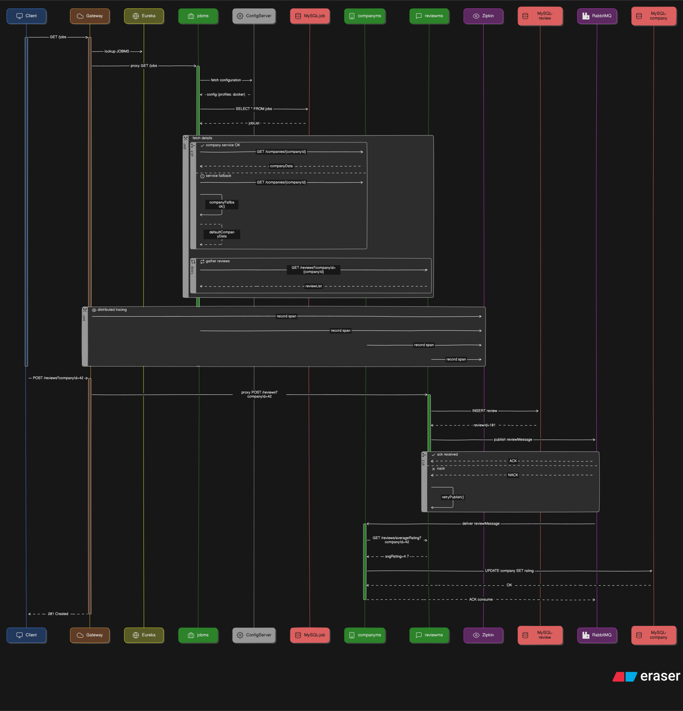

# Job Management Application

&#x20;  &#x20;

---

## 🌟 Overview

A **feature-rich**, backend-intensive microservice platform to manage **Jobs**, **Companies**, and **Reviews** with real-time rating updates, distributed tracing, and resilient communication.

## 🚀 Key Features

- **Full CRUD** for Jobs, Companies, Reviews
- **Real-Time Rating Aggregation**: Automatic recalculation via RabbitMQ events
- **Distributed Tracing**: Zipkin-based end-to-end performance insights
- **Resilience**: Circuit Breakers (Resilience4j) & fallback handlers
- **Centralized Configuration**: Spring Cloud Config
- **Service Discovery**: Eureka Registry & Spring Cloud Gateway
- **Inter-Service Communication**: OpenFeign clients
- **Monitoring**: Actuator endpoints integration
- **CI/CD**: GitHub Actions workflow for build/test/deploy
- **Containerization**: Docker images + Docker Compose blueprint

## 📦 Microservices Architecture
- 

## 📋 API Endpoints

| Service       | Endpoint              | Method   | Description                                  |
| ------------- | --------------------- | -------- | -------------------------------------------- |
| **Gateway**   | `/jobs/**`            | All      | Proxy to Job Service                         |
|               | `/companies/**`       | All      | Proxy to Company Service                     |
|               | `/reviews/**`         | All      | Proxy to Review Service                      |
| **jobms**     | `/api/jobs`           | `GET`    | List all jobs                                |
|               | `/api/jobs/{id}`      | `GET`    | Get job by ID                                |
|               | `/api/jobs`           | `POST`   | Create a new job                             |
|               | `/api/jobs/{id}`      | `PUT`    | Update job by ID                             |
|               | `/api/jobs/{id}`      | `DELETE` | Delete job by ID                             |
| **companyms** | `/api/companies`      | `GET`    | List all companies                           |
|               | `/api/companies/{id}` | `GET`    | Get company by ID                            |
|               | `/api/companies`      | `POST`   | Create a new company                         |
|               | `/api/companies/{id}` | `PUT`    | Update company by ID                         |
|               | `/api/companies/{id}` | `DELETE` | Delete company by ID                         |
| **reviewms**  | `/api/reviews`        | `GET`    | List all reviews                             |
|               | `/api/reviews/{id}`   | `GET`    | Get review by ID                             |
|               | `/api/reviews`        | `POST`   | Create a new review (triggers rating update) |
|               | `/api/reviews/{id}`   | `PUT`    | Update review by ID                          |
|               | `/api/reviews/{id}`   | `DELETE` | Delete review by ID                          |

## ⚙️ Configuration & Environment

| Component       | Property                       | Example                         |
| --------------- | ------------------------------ | ------------------------------- |
| **Config Repo** | `application-config.properites`| YAML files per environment      |
| **DataSource**  | `spring.datasource.url`        | `jdbc:mysql://mysql:3306/jobdb` |
| **RabbitMQ**    | `spring.rabbitmq.host`         | `rabbitmq`                      |
| **Zipkin**      | `spring.zipkin.base-url`       | `http://zipkin:9411/`           |
| **Feign**       | `feign.client.config.default`  | timeout, retry configs          |


### Local Development

```bash
# Clone repo
git clone https://github.com/Aditya4114/Job-Application_Backend
cd Job-Application_Backend
```


## 🛠️ Getting Started

### Prerequisites

- Java 17+
- Maven/Gradle
- Docker & Docker Compose
- RabbitMQ
- MySQL

### Local Development (needs docker for zipkin and rabbitmq)

```bash
# Clone repo
git clone https://github.com/Aditya4114/Job-Application_Backend.git
cd job-management-app

# Start Config & Eureka
docker-compose up -d config-server eureka

# Run services locally
mvn -pl config-server spring-boot:run
mvn -pl eureka-server spring-boot:run
mvn spring-boot:run -Dspring-boot.run.profiles=dev -pl jobms,companyms,reviewms,gateway
```

### DockerHub Images
- Username: Adi4114

### Dockerized Deployment

```bash
# Pull and start all services
docker pull <image-name>:<tag>
docker-compose up -d

# Verify
docker ps
```

## 📊 Monitoring & Tracing

- **Swagger UI**: `http://localhost:8080/swagger-ui.html`
- **Actuator Endpoints**: `/actuator/health`, `/actuator/metrics`
- **Zipkin UI**: `http://localhost:9411`

## 💡 Resilience & Circuit Breaking

Configured with Resilience4j:

```java
@FeignClient(name = "companyms", fallback = CompanyFallback.class)
public interface CompanyClient { }
```

## 🔄 Messaging & Event-Driven Updates

- **Exchange**: `company.review.updates`
- **Routing Key**: `company.review`

When a review is created/updated, `reviewms` publishes an event to recalculate the company’s overall rating.

## 📈 CI/CD Pipeline

- **GitHub Actions**: Build → Test → Docker Publish → Deploy

## 🤝 Contributing

1. Fork & clone the repo
2. Create a branch: `git checkout -b feat/XYZ`
3. Commit: `git commit -m "Add XYZ feature"`
4. Push: `git push origin feat/XYZ`
5. Open a PR and request review
